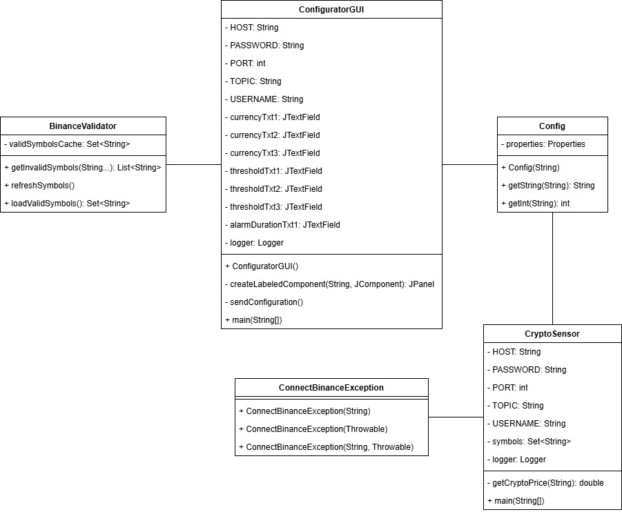
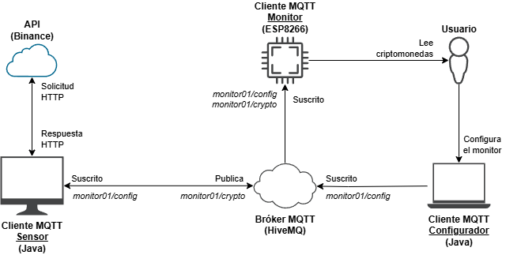
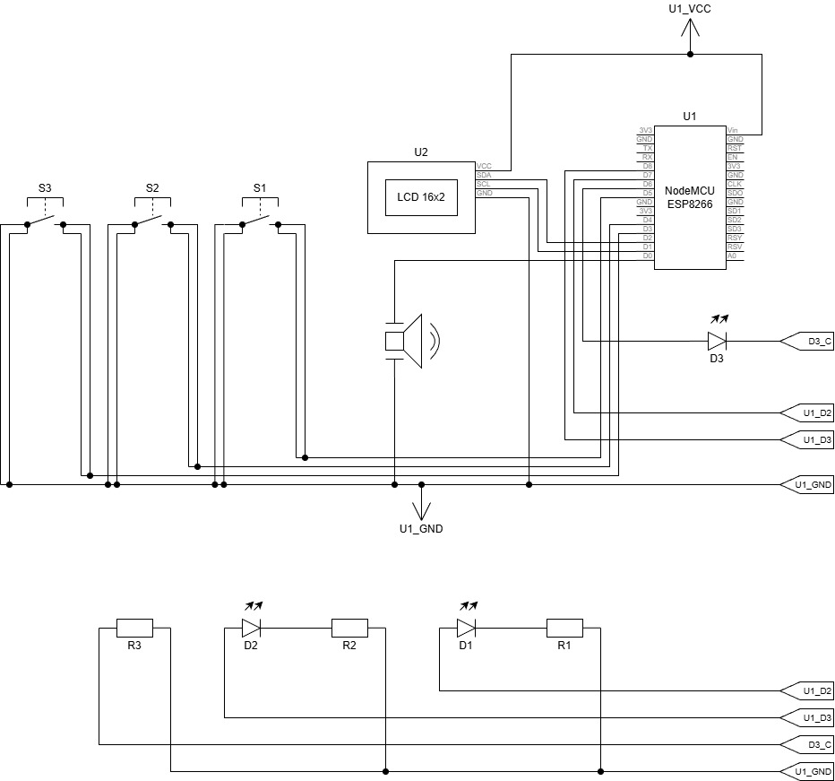
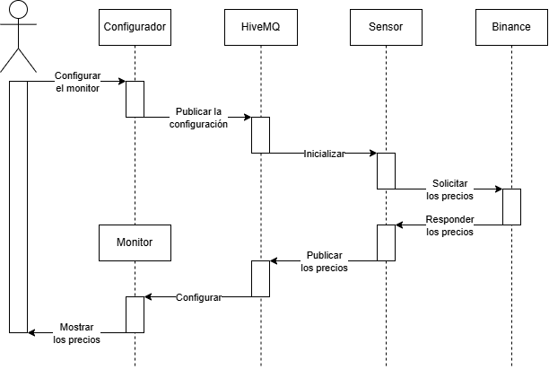

# 📈 IoT Cryptocurrency Monitor with MQTT & ESP8266

This project is an IoT system designed to monitor cryptocurrency prices in real-time using the Binance API, the MQTT protocol, and an ESP8266 microcontroller. It allows for price visualization, visual trend alerts (LEDs), and audible alarms (Buzzer) based on remotely configurable thresholds.

## 📋 Overview

The system decouples the data retrieval logic from the visualization using a Publisher/Subscriber architecture with MQTT. It consists of three main modules connected via a Cloud Broker (HiveMQ):

1. **Monitor (ESP8266):** Visualizes prices and manages physical alerts (LCD, LEDs, Buzzer) .
2. **Sensor (Java):** Queries the Binance API via HTTP and publishes prices to the broker.
3. **Configurator (Java Swing):** A GUI application to remotely configure which coins to track and set alarm thresholds.

## 🚀 Key Features

* **Real-Time Visualization:** Displays the currency pair (e.g., BTCUSDT) and its current price on a 16x2 LCD screen.
* **Visual Trend Indicators:** Three LEDs indicate price fluctuations:
  * 🟢 **Green LED:** Price increased.
  * 🔴 **Red LED:** Price decreased.
  * ⚪ **White LED:** Price remained stable.
* **Audible Alarm:** A Buzzer triggers when the price reaches a user-defined threshold.
* **Remote Configuration:** Dynamic updates of cryptocurrency symbols, price limits, and alarm duration without reflashing the hardware.
* **Secure Connectivity:** Uses MQTT over TCP/IP with TLS encryption (Port 8883).

## 🛠️ Architecture & Network Topology

The project uses a client-server architecture centered around an MQTT Broker.

* **Protocols:** HTTP (for Binance API) and MQTT (for internal IoT messaging).
* **Broker:** HiveMQ Cloud (TLS/SSL).

## 📦 Hardware Requirements

Components used in the prototype:

| Component | Quantity | Description |
| :--- | :---: | :--- |
| ESP8266 NodeMCU | 1 | WiFi Microcontroller |
| LCD 16x2 Screen | 1 | Data display |
| I2C Interface Module | 1 | For LCD control |
| Buzzer | 1 | Audible alarm |
| Push Buttons | 3 | Coin selection |
| Green LED | 1 | "Price Up" indicator |
| Red LED | 1 | "Price Down" indicator |
| White LED | 1 | "Stable Price" indicator |
| Resistors (220 Ω) | 3 | For LEDs |
| Breadboard & Wires | 1 | For assembly |

## 💻 Software & Dependencies

### 1. Monitor Client (ESP8266 Firmware)

Developed in the **Arduino IDE**.

* **Libraries:** `PubSubClient` (MQTT), `LiquidCrystal_I2C`, `ESP8266WiFi`.

### 2. Sensor & Configurator Clients (Desktop)

Applications developed in **Java**.

* **Libraries:** `hivemq-mqtt-client` for MQTT communication.
* **API:** Binance Public API for fetching price data.
* **GUI:** Java Swing (for the Configurator).

## 📡 MQTT Topic Structure

The system uses the following topic hierarchy for communication:

### Configuration (`monitor01/config/`)

* `monitor01/config/button{X}/symbol`: Cryptocurrency symbol (e.g., BTCUSDT) for button X.
* `monitor01/config/button{X}/threshold`: Price limit for the alarm.
* `monitor01/config/alarmDuration`: Alarm duration in milliseconds.

### Data (`monitor01/crypto/`)

* `monitor01/crypto/{SYMBOL}`: Current price of the cryptocurrency (e.g., `monitor01/crypto/BTCUSDT`).

## ⚙️ Installation & Usage

1. **Hardware:** Assemble the circuit according to the schematic diagram.
2. **Firmware:**
    * Configure WiFi credentials and MQTT Broker details in the ESP8266 code.
    * Upload the code to the NodeMCU.
3. **Java Software:**
    * Run the **Configurator** to set initial coins and thresholds.
    * Run the **Sensor**; it will read the config, connect to Binance, and start publishing prices.
4. **Operation:**
    * Press the physical buttons on the prototype to toggle between the 3 configured coins.
    * Watch the LEDs for market trends and listen for the buzzer if thresholds are met.

## 📄 License & Credits

This project was designed and implemented as a Systems Engineering project.

* **Author:** Gerardo Elián Martínez Ramírez.
* **Institution:** Pontificia Universidad Javeriana.
